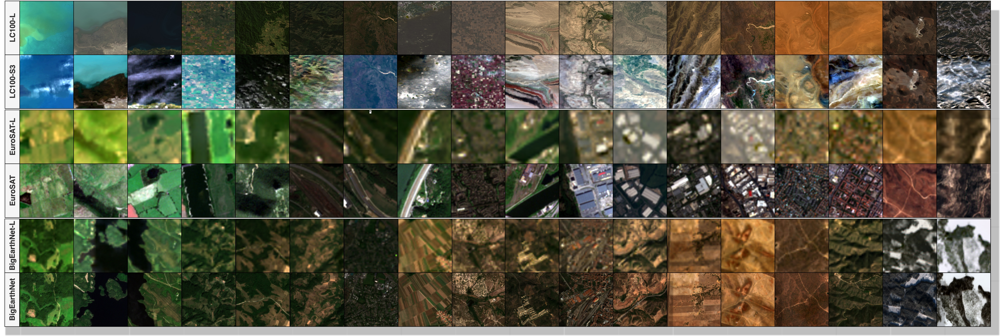
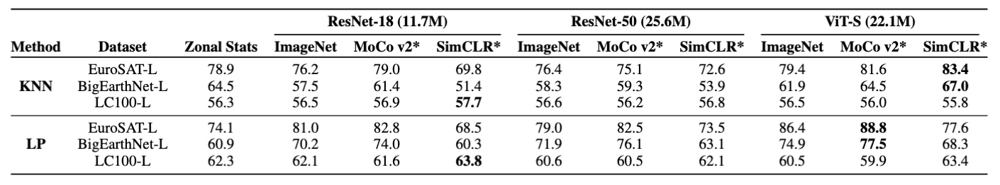

<div align="center">
<h2>Landsat-Bench: Datasets and Benchmarks for Landsat Foundation Models</h2>

[**Isaac Corley**](https://isaacc.dev/)<sup>1</sup> · [**Lakshay Sharma**](https://scholar.google.com/citations?user=8P7Zxa0AAAAJ)<sup>2</sup> · [**Ruth Crasto**](https://scholar.google.com/citations?user=k7GBkUEAAAAJ)<sup>2</sup> ·

<sup>1</sup>Wherobots&emsp;&emsp;&emsp;&emsp;<sup>2</sup>Microsoft

<a href="https://arxiv.org/abs/2401.06762"></a>
<a href='https://huggingface.co/datasets/isaaccorley/eurosat-l/'></a><a href='https://huggingface.co/datasets/isaaccorley/bigearthnet-l/'></a><a href='https://huggingface.co/datasets/isaaccorley/lc100-l/'></a>
</div>

<p align="center">
    <br/>
</p>


We introduce Landsat-Bench: a new benchmark for Geospatial Foundation Models (GFM) pretrained on Landsat imagery. Our benchmark contains three Landsat variants (denoted with the suffix “—L”.) of existing remote sensing datasets: EuroSAT-L, BigEarthNet-L & LC100-L.

<p align="center">
    <br/>
    <b>Figure 1.</b> Comparisons of the datasets in Landsat-Bench and their original forms. ML and MT indicate multi-label
and multi-temporal datasets, respectively.
</p>


## Updates

- [2025.06]: Landsat-Bench has been accepted for presentation at the [ICML TerraBytes Workshop](https://terrabytes-workshop.github.io/)!
- [2025.05]: Datasets have been released on HuggingFace! [EuroSAT-L](https://huggingface.co/datasets/isaaccorley/eurosat-l), [BigEarthNet-L](https://huggingface.co/datasets/isaaccorley/bigearthnet-l), [LC100-L](https://huggingface.co/datasets/isaaccorley/lc100-l)

### Installation

```bash
pip install .
```

### Usage

Datasets can be loaded using the `landsatbench` package like below:

```python
from landsatbench.datamodule import LandsatDatamodule

dm = LandsatDataModule(name="eurosat", root=root, batch_size=16, num_workers=4, download=False)
dm.setup(stage="fit")

train_dataloader = dm.train_dataloader()
test_dataloader = dm.test_dataloader()

for batch in train_dataloader:
    images, labels = batch["image"], batch["label"]
    ...

dm.setup(stage="test")
test_dataloader = dm.test_dataloader()
for batch in test_dataloader:
    images, labels = batch["image"], batch["label"]
    ...

```

### Evaluation

To evaluate the performance of models on the Landsat-Bench datasets, we provide a set of embedding generation and evaluation scripts in the `eval` directory. These scripts can be used to compute metrics using KNN and Linear Probing evaluations directly on the embeddings of each dataset.

Precomputed embeddings for the 9 baseline methods are made available on HuggingFace [here](https://huggingface.co/datasets/isaaccorley/landsat-bench-embeddings).

### Leaderboard

Our paper evaluates the performance of 9 pretrained model baselines on Landsat-Bench. We report both KNN (k=5) and Linear Probe (LP) results on extracted features of each method. For EuroSAT-L classification we report overall accuracy (OA). For
BigEarthNet-L and LC100-L multilabel classification we report (micro) mean average precision (mAP). * denotes the model
was pretrained on the [SSL4EO-L](https://arxiv.org/abs/2306.09424) dataset using the weights made available in [TorchGeo](https://github.com/microsoft/torchgeo).

<p align="center">
    <br/>
</p>

### Dataset Creation

To recreate the datasets please install the dev dependencies `pip install .[dev]` and use the following scripts in the `data` directory:

- The `extract*` scripts to obtain the metadata from the original datasets and save as parquet.

- The `download*` scripts to download the Landsat 8 collection imagery from the USGS and/or Planetary Computer STAC APIs.


## Citation

If you use this dataset in your work please cite our paper:
