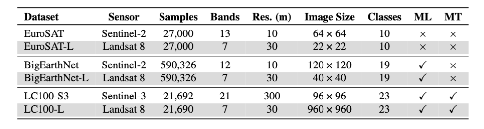

<div align="center">
<h2>Landsat-Bench: Datasets and Benchmarks for Landsat Foundation Models</h2>

[**Isaac Corley**](https://isaacc.dev/)<sup>1</sup> · [**Lakshay Sharma**](https://scholar.google.com/citations?user=8P7Zxa0AAAAJ)<sup>2</sup> · [**Ruth Crasto**](https://scholar.google.com/citations?user=k7GBkUEAAAAJ)<sup>2</sup> ·

<sup>1</sup>Wherobots&emsp;&emsp;&emsp;&emsp;<sup>2</sup>Microsoft

<a href="https://arxiv.org/abs/2506.08780"></a>
<a href='https://huggingface.co/datasets/isaaccorley/eurosat-l/'></a><a href='https://huggingface.co/datasets/isaaccorley/bigearthnet-l/'></a><a href='https://huggingface.co/datasets/isaaccorley/lc100-l/'></a>
</div>

<p align="center">
    <br/>
</p>


We introduce Landsat-Bench: a new benchmark for Geospatial Foundation Models (GFM) pretrained on Landsat imagery. Our benchmark contains three Landsat variants (denoted with the suffix “—L”.) of existing remote sensing datasets: EuroSAT-L, BigEarthNet-L & LC100-L.

<p align="center">
    <br/>
    <b>Figure 1.</b> Comparisons of the datasets in Landsat-Bench and their original forms. ML and MT indicate multi-label
and multi-temporal datasets, respectively.
</p>


## Updates

- [2025.06]: We've benchmarked additional models (Prithvi v1, Prithvi v2, DOFA, and Satlas)! Prithvi-EO-2.0 600M is the new SOTA on EuroSAT-L! More benchmarks to come soon!
- [2025.06]: Landsat-Bench has been accepted for presentation at the [ICML TerraBytes Workshop](https://terrabytes-workshop.github.io/)!
- [2025.05]: Datasets have been released on HuggingFace! [EuroSAT-L](https://huggingface.co/datasets/isaaccorley/eurosat-l), [BigEarthNet-L](https://huggingface.co/datasets/isaaccorley/bigearthnet-l), [LC100-L](https://huggingface.co/datasets/isaaccorley/lc100-l)

### Installation

```bash
pip install .
```

### Usage

Datasets can be loaded using the `landsatbench` package like below:

```python
import kornia.augmentation as K
from landsatbench.datamodule import LandsatDatamodule
from landsatbench.datasets.eurosat import dataset_statistics

dm = LandsatDataModule(name="eurosat", root=root, batch_size=16, num_workers=4, download=False)
dm.setup(stage="fit")

transforms = K.ImageSequential(
    K.Normalize(mean=dataset_statistics["mean"], std=dataset_statistics["std"]),
    K.Resize(224),
    keepdim=True,
)

train_dataloader = dm.train_dataloader()
test_dataloader = dm.test_dataloader()

for batch in train_dataloader:
    images, labels = batch["image"], batch["label"]
    images = transforms(images)
    ...

dm.setup(stage="test")
test_dataloader = dm.test_dataloader()
for batch in test_dataloader:
    images, labels = batch["image"], batch["label"]
    images = transforms(images)
    ...

```

### Evaluation

To evaluate the performance of models on the Landsat-Bench datasets, we provide a set of embedding generation and evaluation scripts in the `eval` directory. These scripts can be used to compute metrics using KNN and Linear Probing evaluations directly on the embeddings of each dataset.

Precomputed embeddings for the 9 baseline methods are made available on HuggingFace [here](https://huggingface.co/datasets/isaaccorley/landsat-bench-embeddings).

### Leaderboard

Our paper evaluates the performance of 9 pretrained model baselines on Landsat-Bench. We report both KNN (k=5) and Linear Probe (LP) results on extracted features of each method. For EuroSAT-L classification we report overall accuracy (OA). For
BigEarthNet-L and LC100-L multilabel classification we report (micro) mean average precision (mAP). * denotes the model
was pretrained on the [SSL4EO-L](https://arxiv.org/abs/2306.09424) dataset using the weights made available in [TorchGeo](https://github.com/microsoft/torchgeo).

|Model                     |EuroSAT-L (KNN)|EuroSAT-L (LP)|BigEarthNet-L (KNN)|BigEarthNet-L (LP)|LC100-L (KNN)|LC100-L (LP)|
|:------------------------:|:-------------:|:------------:|:-----------------:|:----------------:|:-----------:|:----------:|
|    ImageNet ResNet-18    |     76.2      |     81.0     |       57.5        |       70.2       |    56.5     |    62.1    |
|    ImageNet ResNet-50    |     76.4      |     79.0     |       58.3        |       71.9       |    56.6     |    60.6    |
|    ImageNet ViT-S/16     |     79.4      |     86.4     |       61.9        |       74.9       |    56.5     |    60.5    |
|SSL4EO-L ResNet-18 SimCLR |     69.8      |     68.5     |       51.4        |       60.3       |    57.7     |    63.8    |
|SSL4EO-L ResNet-18 MoCo v2|     79.0      |     82.8     |       61.4        |       74.0       |    56.9     |    61.6    |
|SSL4EO-L ResNet-50 SimCLR |     72.6      |     73.5     |       53.9        |       63.1       |    56.8     |    62.1    |
|SSL4EO-L ResNet-50 MoCo v2|     75.1      |     82.5     |       59.3        |       76.1       |    56.2     |    60.5    |
| SSL4EO-L ViT-S/16 SimCLR |     83.4      |     77.6     |       67.0        |       68.3       |    55.8     |    63.4    |
|SSL4EO-L ViT-S/16 MoCo v2 |     81.6      |     88.8     |       64.5        |       77.5       |    56.0     |    59.9    |
|        DOFA-B/16         |     80.0      |     87.3     |                   |                  |             |            |
|     Satlas Swin V2-B     |     84.1      |     89.6     |                   |                  |             |            |
|        DOFA-L/16         |     84.5      |     89.8     |                   |                  |             |            |
|     Prithvi-EO-100M      |     86.4      |     89.4     |                   |                  |             |            |
|   Prithvi-EO-2.0 300M    |     87.3      |     91.1     |                   |                  |             |            |
|   Prithvi-EO-2.0 600M    |     88.7      |     91.9     |                   |                  |             |            |


### Dataset Creation

To recreate the datasets please install the dev dependencies `pip install .[dev]` and use the following scripts in the `data` directory:

- The `extract*` scripts to obtain the metadata from the original datasets and save as parquet.

- The `download*` scripts to download the Landsat 8 collection imagery from the USGS and/or Planetary Computer STAC APIs.


## Citation

If you use this dataset in your work please cite our paper:

```bibtex
@misc{corley2025landsatbenchdatasetsbenchmarkslandsat,
      title={Landsat-Bench: Datasets and Benchmarks for Landsat Foundation Models}, 
      author={Isaac Corley and Lakshay Sharma and Ruth Crasto},
      year={2025},
      eprint={2506.08780},
      archivePrefix={arXiv},
      primaryClass={cs.CV},
      url={https://arxiv.org/abs/2506.08780}, 
}
```
